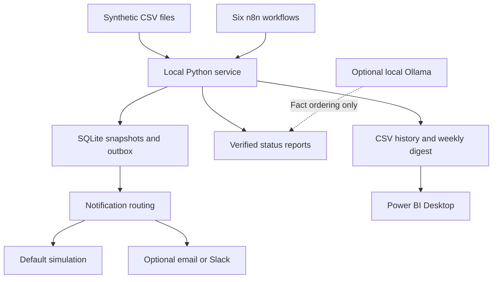

# Project Delivery Automation Hub

A local-first, synthetic PMO portfolio project: six n8n workflows coordinate project-health monitoring, escalation, stakeholder reporting, notification routing, weekly summaries and Power BI-ready history.

**Portfolio disclosure:** every project, task, risk, milestone, budget, dependency and stakeholder is synthetic. This project has not been deployed for a real employer or client. No business savings or delivery improvements are claimed.

**Validation boundary:** business logic and the local HTTP service were executed in the build environment. Workflow JSON was statically checked against selected official n8n node definitions. **REQUIRES LOCAL N8N VALIDATION:** importing and executing the workflows, Docker runtime, schedules and provider integrations. See [test evidence](docs/test-results.md) and [final audit](docs/final-audit.md).

## Business problem and solution

Project updates are often spread across task lists, risk registers and budget sheets. Reviewing them manually can hide late milestones or critical dependencies behind an otherwise positive status. This demonstration applies transparent rules to a ten-project portfolio and produces traceable exceptions, reports and historical data.

n8n handles schedules, stage invocation, notification branches and integration credentials. A dependency-free Python service handles validation and PMO rules; SQLite provides transactions, history, issue episodes and a durable notification outbox. **Scoring is implemented in Python, not inside n8n Code nodes.** This deliberate companion-service design makes state and retries testable without depending on n8n's internal database or static workflow data.

## Architecture



This is a **scheduled, event-backed pipeline**: snapshots and queued records act as durable events, and downstream workflows poll for unfinished work. It does not implement live push webhooks or an external message broker.

## Features and implementation status

| Capability | Status |
|---|---|
| Validation, health scoring and critical-condition overrides | Implemented; Python tests executed |
| Historical snapshots and computed improving/deteriorating trends | Implemented; two synthetic dates demonstrated |
| Escalation episodes and duplicate suppression | Implemented; durable SQLite state |
| Reports with all requested stakeholder sections | Implemented; deterministic default |
| AI-assisted fact ordering with strict output validation | Implemented adapter; fallback tested; actual Ollama run requires configuration |
| Healthy / At Risk / Critical recipient routing | Implemented; simulated delivery tested |
| Native SMTP and Slack delivery branches | Implemented export templates; disabled; credentials and local testing required |
| Weekly portfolio digest, Markdown and JSON | Implemented; generated from latest snapshots |
| Analytics CSV and report exports | Implemented; no `.pbix` dashboard or cloud refresh included |
| n8n import and runtime behavior | Six genuine core-node export files; local validation required |

## Workflow map

| File | Purpose | Schedule, Europe/Berlin |
|---|---|---|
| `01-project-health-monitor.json` | Read CSVs through service; validate and save health | Daily 08:00 |
| `02-risk-escalation.json` | Process unhandled snapshots; create issue episodes | Every minute, second 0 |
| `03-ai-status-report.json` | Produce verified report and eligible outbox record | Every minute, second 10 |
| `04-stakeholder-notification.json` | Claim one item; simulate or deliver; acknowledge | Every minute, second 20 |
| `05-weekly-pmo-digest.json` | Summarize latest available portfolio | Monday 09:00 |
| `06-analytics-pipeline.json` | Export CSV history, reports and escalation JSON | Every minute, second 30 |

Each has a manual trigger. Imports are inactive. Workflow IDs do not need to be copied between workflows because the service persists stage state. Schedule offsets improve readability but are not synchronization: stage prerequisites and transactions enforce order.

## Scoring methodology

Start at 100 and subtract five bounded penalties:

| Dimension | Penalty |
|---|---|
| Overdue tasks | `min(30, overdue_task_percentage × 0.6)` |
| Open milestone variance | `min(20, largest_variance_days × 2)` |
| Unresolved risks | `min(20, high_count × 8 + critical_count × 15)` |
| Blocked dependencies | `min(15, noncritical_count × 5 + critical_count × 15)` |
| Forecast budget overrun | `min(15, max(0, variance_percentage) × 0.75)` |

Round to an integer. Scores **80–100 = HEALTHY**, **60–79 = AT RISK**, **0–59 = CRITICAL**. A critical risk, blocked critical dependency, forecast overrun above 20%, or open milestone slippage above 10 days caps the score at 59. An unresolved high risk, slippage above 5 days or forecast overrun above 10% caps it at 79. These overrides prevent serious exceptions being averaged away. They are demo governance choices, not a calibrated prediction model. [Full business rules](docs/business-rules.md).

## Stack and data

Self-hosted n8n Community Edition, Docker Compose, Python 3.12 standard library, SQLite, CSV/JSON/Markdown, optional Ollama, optional SMTP or Slack, and Power BI Desktop as an optional consumer. No paid AI API or n8n Cloud is required.

The current fixture includes **10 projects, 120 tasks, 30 risks, 20 milestones, 20 dependencies, 10 budgets and 20 stakeholder records**. A second complete synthetic fixture supplies the previous day. Seeds and generators are included.

```text
workflows/        Six importable n8n exports
data/             Current synthetic CSVs and baseline/ fixture
service/          Validated PMO rules, SQLite state and HTTP endpoints
scripts/          Data/export generators, demo runner and checks
tests/            Executable rules, persistence and HTTP tests
docs/             Setup, architecture, security, tests and portfolio copy
diagrams/         Mermaid architecture and delivery-state diagrams
examples/         Outputs produced by the service demo
.github/workflows/ CI checks (CI itself not run in this environment)
```

## Setup and import

**Already have n8n on port 5678 with `n8n_data`? Start with [the Windows setup guide](docs/setup-guide.md).** It covers image-version checks, a stopped-volume backup, reuse of the existing volume and a separate-volume evaluation option. Do not run two n8n containers against the same volume. Do not overwrite an existing external encryption key or database settings.

After those existing-instance precautions:

```powershell
Copy-Item .env.example .env
New-Item -ItemType Directory -Force output | Out-Null
# Set N8N_IMAGE in .env to the exact image you intend to run.
docker compose config --quiet
docker compose up -d --build
```

Open `http://localhost:5678`. Import files using the workflow menu → **Import from File** in order **01, 02, 03, 04, 05, 06**. Save each. No credentials are required for the default demo. Leave email and Slack nodes disabled. Execute manually in order **01 → 02 → 03 → 04 → 06 → 05**. Repeat 04 to drain the queue, or enable its schedule after the local smoke checks. [Exact steps and configuration](docs/setup-guide.md).

The demo date is deliberately frozen at **2026-09-23** so overdue conditions remain reproducible. The first monitor run seeds **2026-09-22** from `data/baseline/`, then processes the current data. Genuinely changing source data on an already-recorded date is rejected, not silently overwritten.

## Demo and sample output

[Five-minute demonstration](docs/demo-script.md) · [Generated report](examples/weekly-status-report.md) · [Critical escalation](examples/critical-escalation.md) · [Weekly digest](examples/weekly-digest.md) · [Analytics CSV](examples/portfolio-health.csv).

The current synthetic day produces **3 Healthy, 2 At Risk and 5 Critical** projects. River Recovery improves and Beacon Platform Refresh deteriorates compared with the computed baseline. The analytics example contains **20 rows across two dates**.

Diagrams are source-controlled Mermaid in `diagrams/` and rendered inline in these docs. No screenshots are fabricated. After local verification, capture the six canvases and an execution result; omit credentials and recipient details before publishing.

## Testing

With Python 3.12 and Node.js installed, from the repository root:

```powershell
python -m unittest discover -s tests -v
python scripts/check_workflows.py
python scripts/demo.py
```

The demo runner uses temporary state, writes outputs to `output/`, and does not modify the n8n Docker volumes. `python scripts/test_report.py` regenerates expected-versus-actual test evidence. Source references and hashes for static node checks are in `docs/node-source-manifest.json`. See [test plan](docs/testing.md) for the required n8n smoke tests.

## Security and limitations

Secrets are not present in exports; optional delivery credentials belong in n8n's credential store. The API has no published host port and is intended only for a trusted local Compose network. Do not expose it to a public or shared network without authentication and TLS. Detailed [security notes](docs/security.md) cover volumes, backups, least privilege, execution logs and secret handling.

SQLite is appropriate for this small local demonstration, not a claim of enterprise-scale operation. Notifications have durable duplicate protection, but external delivery is **at least once**: if a provider accepts a message and the process crashes before acknowledgement, a later retry can repeat it. The project does not claim exactly-once SMTP/Slack delivery. Live integrations and Ollama need local acceptance tests. No employer systems, actual project results, live cost data or real personal information were used.

Future improvements: authenticated push ingestion, provider-supported idempotency, operational alerting for dead letters, independent report review, schema migrations, retention policies, multi-user authorization and a Power BI dashboard. These are not implemented.

## Portfolio use

[Repository description, topics, three CV bullets, LinkedIn project description, interview questions and factual answers](docs/portfolio-guide.md).

License: MIT for this repository's original code and documentation. n8n and optional tools retain their own licenses; n8n is not relicensed by this repository.
