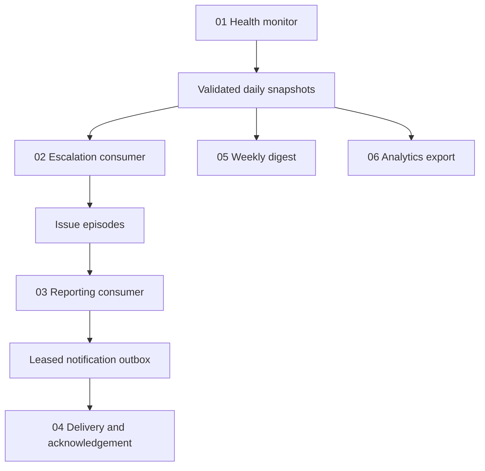
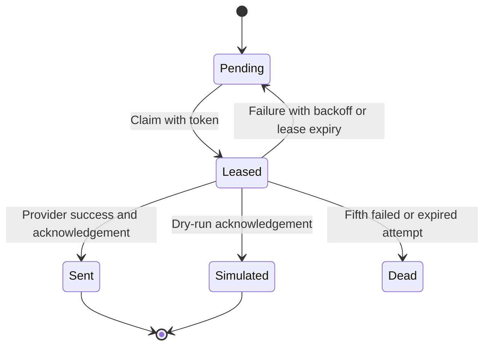

# Architecture

## Boundaries and responsibilities

n8n uses standard Manual Trigger, Schedule Trigger, HTTP Request, IF, Code, Send Email, Slack and Sticky Note nodes. There are no community nodes, filesystem Code-node hacks, Python Code nodes, or paid n8n features. The single Code node is a deliberate live-delivery configuration gate. Node source references are pinned in `node-source-manifest.json`.

The internal `hub-api` service is a standard-library HTTP adapter around independently testable Python rules and a SQLite store. It reads the mounted repository CSV files; n8n has the same read-only files at `/files/data` but does not need to parse them itself. This adds one small companion container in exchange for transaction-backed state and a clear testing boundary.

Each workflow is independently importable and manually runnable. No internal workflow-ID substitution, public webhook registration or credentials are needed in the default path. Stage 03 only consumes snapshots marked escalated. Stage 04 only sees completed report outbox records. Transactions commit records and stage markers together. Temporary provider/model failures do not erase upstream snapshots.

## API contract

All endpoints are internal to the trusted Compose network. JSON bodies are at most 64 KiB. POSTs with no parameters accept `{}`. Errors use HTTP 422 for rejected input or 500 for unexpected stage failure; 404 for unknown routes.

| Endpoint | Method | Result |
|---|---|---|
| `/health` | GET | Record counts and notification states; readiness check |
| `/monitor` | POST | Load fixed source directory and configured as-of date; number created |
| `/escalate` | POST | Consume pending snapshots; number of new escalations |
| `/report` | POST | Generate pending reports; count and fallback count |
| `/notifications/claim` | POST | Array of zero or one leased notification |
| `/notifications/ack` | POST | Body: notification_id, lease_token, success boolean, simulated boolean |
| `/digest` | POST | Structured portfolio result and Markdown; write digest exports |
| `/analytics` | POST | Write history CSV, reports and escalations; return paths/counts |

The API intentionally lacks arbitrary path/query execution, a public file browser or SQL endpoint. It also lacks multi-user authorization: network isolation is its local-demo security boundary.

## State and concurrency

`batches` stores source checksums. `snapshots` stores payloads and stage flags. `episodes` tracks active conditions and recurrence. `escalations`, `reports`, `outbox`, `digests`, and `events` hold downstream state. Unique primary keys enforce duplicate protection. SQLite WAL and `BEGIN IMMEDIATE` serialize writes with a 30-second busy timeout. The report's model call runs outside the transaction; a final unique insert prevents concurrent report jobs from duplicating output.

`Leased` is represented by `state=pending` plus a future lease timestamp. Acknowledgements require the current token; stale or expired ones are rejected. Repeated successful acknowledgements are harmless. State survives service restarts via `hub_state`; n8n's independent existing `n8n_data` volume remains separate.

## Files and analytics

The host `output/` bind mount receives `portfolio-health.csv`, `escalations.json`, `reports/YYYY-MM-DD-Pxx.md` and weekly digest JSON/Markdown. CSV replacement is atomic; reports and digest files are convenience exports from authoritative database records and can be regenerated after interruption. Avoid opening a destination CSV exclusively in Excel while export runs on Windows; the workflow can retry once the file lock is released.

## Failure handling

HTTP stage nodes retry up to three times with two seconds between attempts. Side effects use unique records and transactional markers. Direct email/Slack nodes do not have automatic node-level retries; failures route to the negative acknowledgement node, which persists the retry schedule. Missing credentials, an execution interruption or the live-delivery gate can stop a run before that branch; the lease still expires and recovers.

Unrecoverable validation errors stop the monitor and appear in n8n execution history. Small sanitized service events record the error category, not raw payloads or secrets. There is no external failure-alert service. Repeated failures and dead letters must be reviewed through n8n executions and the service health counts.

## Capacity and scope

The report request has a 240-second client timeout. Optional Ollama has an 8-second per-report timeout; the bundled 20-row two-day demonstration fits this bound. Large portfolios need pagination and bounded worker batches before deployment. The single-item notification claim is deliberately conservative. No throughput, availability or load-testing claims are made.
